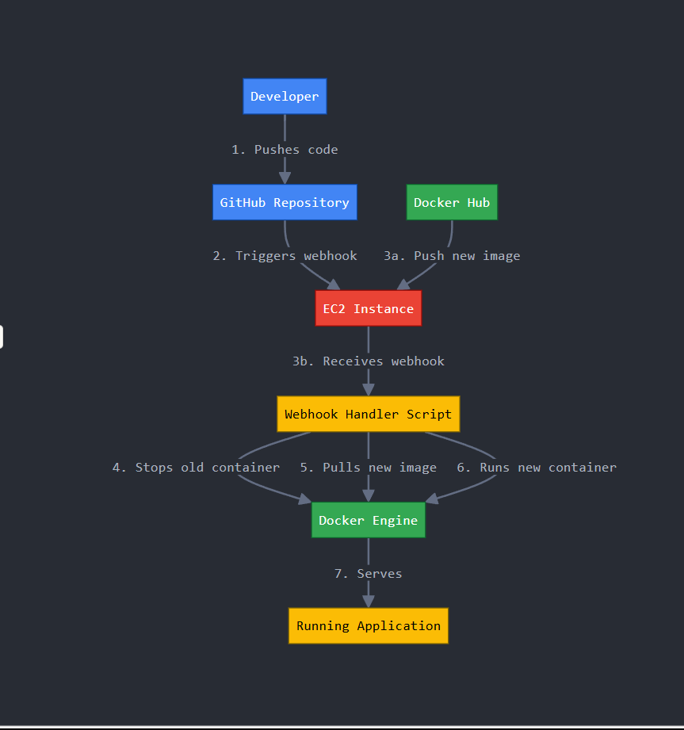

# Part One: Continuous Deployment Documentation

## Generating Tags

### How to See Tags in a Git Repository

You can view all tags in your repository using:

```bash
git tag
```

### How to Generate a Tag in a Git Repository

To create a tag, use this format:

```bash
git tag v1.0.0
```

### How to push a tag in a git repository to GitHub
After creating a tag locally, push it to GitHub using:

```bash
git push origin v1.0.0
This will trigger workflows if they're configured to run on tag creation.


```
### Semantic Versioning Container Images with GitHub Actions

#### Summary of what your workflow does and when it does it

The workflow is triggered every time a new tag is pushed to the repository. It uses the tag to semantically version the Docker image, builds the image, and then pushes it to DockerHub with the correct version label.

#### Explanation of workflow steps

1. **Checkout Code** – Uses `actions/checkout` to get the code from the repository.
2. **Set Up Docker** – Initializes Docker so we can build and push images.
3. **Generate Metadata** – Uses `docker/metadata-action` to create version tags based on the Git tag.
4. **Log In to DockerHub** – Authenticates with DockerHub using secrets stored in the repo.
5. **Build and Push Image** – Builds the Docker image and pushes it to DockerHub using the generated tags.

#### Explanation / highlight of values that need updated if used in a different repository

- `DOCKERHUB_USERNAME` – Update this with proper DockerHub username.
- `DOCKERHUB_TOKEN` – Update this with  DockerHub access token.
- `repository` in the metadata and build steps – Change this to match your DockerHub repo name.
- `tags` – These are auto-generated by the metadata-action, but should match your versioning format.

#### Changes in workflow

Compared to Project 4:
- This version adds a `on: push: tags:` trigger.
- It includes the `docker/metadata-action` to handle version labels.
- Docker build and push now use dynamic tags based on Git tag metadata.

#### Changes in repository

- GitHub secrets `DOCKERHUB_USERNAME` and `DOCKERHUB_TOKEN` must be added.
- A tag-based deployment strategy is used, instead of always deploying on push to main.

#### Link to workflow file in your GitHub repository

[Click here to view the workflow file](./.github/workflows/semantic-versioning.yml)


# Part 2: Continuous Deployment Documentation

## EC2 Instance Details

### AMI Information
I used the **Amazon Linux 2 AMI (HVM)**. This version is great for running Docker and provides a stable environment.

### Instance Type
I chose the **t2.medium** instance type because it offers:
- **2 vCPUs**
- **4 GB RAM**
This is a balanced option for running Docker containers at a reasonable cost.

### Recommended Volume Size
I used a **30 GB General Purpose (GP2)** volume. This size is enough for storing Docker images, logs, and running the application.

### Security Group Configuration
I set up the security group for the EC2 instance with these rules:
- **Port 22 (SSH)**: Open to specific IP addresses for secure access.
- **Port 80 (HTTP)**: Open to allow people to visit the web application.
- **Port 9000 (Webhook listener)**: Open for receiving webhook triggers from DockerHub or GitHub.

### Security Group Justification
- Port 22 is for SSH access to manage the EC2 instance.
- Port 80 is for serving the application on the web.
- Port 9000 allows the EC2 instance to receive webhooks that trigger the deployment process.

---

## Docker Setup on EC2 Instance

### How to Install Docker for Amazon Linux 2
1. Update the system and install Docker:
    ```bash
    sudo yum update -y
    sudo amazon-linux-extras install docker -y
    sudo service docker start
    sudo usermod -a -G docker ec2-user
    ```
2. Start Docker and enable it to start on reboot:
    ```bash
    sudo service docker start
    sudo systemctl enable docker
    ```

### Additional Dependencies Based on OS
- **Git**: I also installed Git to manage the code and trigger updates:
    ```bash
    sudo yum install git -y
    ```

### How to Confirm Docker is Installed
To check if Docker is installed correctly:
```bash
docker --version
docker info
```
## Testing on EC2 Instance

### How to Pull Container Image from DockerHub Repository
To pull the latest container image from your DockerHub repository, use the following command:

```bash
docker pull atexkay23/my-angular-app:latest
```
### How to Run Container from Image
Once the image is pulled, you can run the container using the following command:

```bash
docker run -d -p 80:80 atexkay23/my-angular-app:latest

```
### Differences Between Using the `-it` Flag and the `-d` Flag

#### `-it` Flag:
The `-it` flag lets you run the container in interactive mode. This means you can see and use the container's terminal for tasks like debugging or providing input.

Example:
```bash
docker run -it atexkay23/my-angular-app:latest
```
### Verifying Container is Successfully Serving the Angular Application:

### Validate from Container Side
To check if the container is serving the application, run this command :

```bash
docker logs my-angular-app
```
### Check from the EC2 Instance
On the EC2 instance, open a web browser and go to the public IP address of the EC2 instance (e.g., `http://<your-ec2-ip>`) to see if the Angular app is working.

### Check from Your Local Machine
From your local computer, open a web browser and type in the public IP of the EC2 instance (e.g., `http://<your-ec2-ip>`) to see if the app can be accessed from outside the EC2 instance.

### Steps to Manually Refresh the Container Application if a New Image is Available on DockerHub

If a new image is available and you want to refresh the container, follow these steps:

1. **Stop and Remove the Running Container:**
    ```bash
    docker stop my-angular-app
    docker rm my-angular-app

    ```

2. **Pull the Latest Image:**
    ```bash
    docker pull atexkay23/my-angular-app:latest
    ```

3. **Run the New Container:**
    ```bash
    docker run -d -p 80:80 atexkay23/my-angular-app:latest
    ```
## Scripting Container Application Refresh

### Create a Bash Script on Your Instance

Create a bash script named `refresh-container.sh` on your EC2 instance. This script will:

1. **Pull the latest image from your DockerHub repository**.
2. **Kill and remove the previously running container**.
3. **Start a new container with the freshly pulled image**.

Here’s an example script:

```bash
#!/bin/bash

# Define the container name
CONTAINER_NAME="angular-app-container"

# Stop and remove the currently running container (if exists)
if [ "$(docker ps -q -f name=$CONTAINER_NAME)" ]; then
    echo "Stopping and removing existing container..."
    docker stop $CONTAINER_NAME
    docker rm $CONTAINER_NAME
else
    echo "No existing container found."
fi

# Pull the latest image from DockerHub repository
echo "Pulling the latest Docker image from DockerHub..."
docker pull atexkay23/my-angular-app:latest

# Run a new container with the freshly pulled image
echo "Starting a new container..."
docker run -d --name $CONTAINER_NAME -p 80:80 atexkay23/my-angular-app:latest

echo "Container $CONTAINER_NAME is now running!"

```
## How to Test the Script

### Make sure the script is executable:
To make the script executable, run the following command:

```bash
chmod +x refresh-container.sh

```
### Link to Bash Script in Repository:
https://github.com/yourusername/yourrepository/tree/main/deployment

## Configuring a Webhook Listener on EC2 Instance

### How to Install Adnanh's Webhook

```bash
sudo yum update -y
sudo yum install -y wget
wget https://github.com/adnanh/webhook/releases/download/v2.8.0/webhook-linux-amd64 -O /usr/local/bin/webhook
sudo chmod +x /usr/local/bin/webhook
```
### How to Verify Successful Installation

To confirm that the `webhook` tool was installed correctly on your EC2 instance, run the following command:

```bash
webhook -version
```
### Summary of the Webhook Definition File

The webhook definition file (usually named `hooks.json`) defines how the webhook service should behave when triggered. Here's an example configuration:

```json
[
  {
    "id": "1",
    "execute-command": "/home/ec2-user/deployment/script.sh",
    "command-working-directory": "/home/ec2-user/deployment",
    "response-message": "Webhook received successfully!",
    "trigger-rule": {
      "match": {
        "type": "payload-hash-sha1",
        "secret": "your-secret",
        "parameter": {
          "source": "header",
          "name": "X-Hub-Signature"
        }
      }
    }
  }
]
```
### How to Verify Definition File Was Loaded

```bash
webhook -hooks /home/ec2-user/deployment/hooks.json -verbose

```
### How to Verify Webhook Is Receiving Payloads

Run this `curl` command:

```bash
curl -X POST -H "X-Hub-Signature: sha1=<signature>" -d '{}' http://<your-ec2-ip>:9000/hooks/1

```
#### How to Monitor Logs from Running Webhook

To monitor real-time logs for the `webhook` service on your EC2 instance, use the following command:

```bash
sudo journalctl -u webhook.service -f

```
### What to Look for in Docker Process Views

Use the following commands to view:

```bash
# View all running containers
docker ps

# View logs from the container named 'angular-web-app'
docker logs angular-web-app

```
### Link to Definition File in Repository
[Webhook Definition File](https://github.com/Atexkay23/blob/main/deployment/hooks.json)

## Configuring a Payload Sender

### Justification for Selecting GitHub or DockerHub as the Payload Sender

GitHub and DockerHub are commonly used for automating tasks like deployment. They support webhooks, making it easy to send notifications to an EC2 instance when certain events happen.

### How to Enable Your Selection to Send Payloads to the EC2 Webhook Listener

#### For GitHub:
1. Go to **Settings > Webhooks > Add webhook** in your repository.
2. In the **Payload URL** field, enter `http://<your-ec2-ip>:9000/hooks/1`.
3. Set **Content type** to `application/json`.
4. Choose the events you want to trigger the webhook (e.g., **push**).
5. Click **Add webhook**.

#### For DockerHub:
1. Go to **Settings > Webhooks** in your DockerHub repository.
2. Add a new webhook with the URL `http://<your-ec2-ip>:9000/hooks/1`.
3. Select the events you want to trigger the webhook (e.g., **Image Push**).
4. Save the webhook.

### Explain What Triggers Will Send a Payload to the EC2 Webhook Listener

A payload is sent when specific events occur, like:
- **GitHub**: On **push**, **pull_request**, etc.
- **DockerHub**: On **Image Push** or **Image Update**.

#### How to Verify a Successful Payload Delivery

1. Check logs on the EC2 instance:
   ```bash
   sudo journalctl -u webhook.service -f


## Description & Diagram

### What is the goal of this project?
The goal of this project is to automate the deployment of a containerized Angular application. When code is pushed or a Docker image is updated, a new container is automatically created and run on the EC2 instance.

### What tools are used in this project and what are their roles?

- **GitHub** – Stores and manages source code. Triggers webhooks on push.
- **DockerHub** – Stores Docker images. Triggers webhook on image push.
- **Docker** – Runs containers on the EC2 instance.
- **EC2 (AWS)** – Server where the container is hosted and deployed.
- **Webhook (adnanh/webhook)** – Listens for payloads and triggers shell scripts.
- **Shell Script** – Refreshes the Docker container with the new image.
- **GitHub Webhooks / DockerHub Webhooks** – Send payloads to the EC2 webhook listener when events occur.

## Diagram of Project



